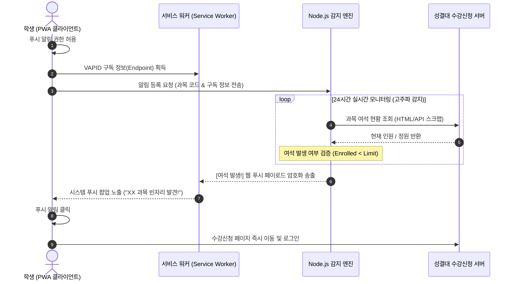
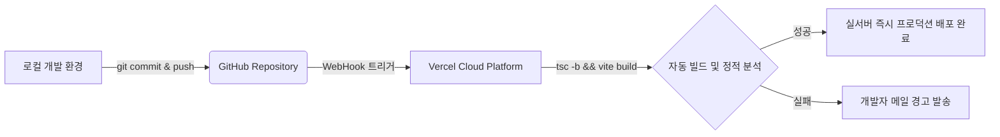

# 🚀 CourseAlert 종합 마스터 개발 및 운영 매뉴얼 (Master Documentation)

본 문서는 **성결대학교 수강신청 빈자리 실시간 감지 및 푸시 알림 서비스인 `CourseAlert`**의 기술 스택, 동작 아키텍처, 핵심 시스템 흐름, 그리고 개발 및 배포 과정에서 축적된 문제 해결 기록(Troubleshooting)을 총망라한 마스터 매뉴얼입니다.

누구나 이 문서를 읽는 것만으로 프로젝트의 전반적인 동작 메커니즘을 완벽하게 이해하고, 유지보수 및 추가 고도화 작업을 막힘없이 진행할 수 있도록 작성되었습니다.

---

## 📂 목차
1. [🌟 서비스 개요 및 핵심 가치](#1-서비스-개요-및-핵심-가치)
2. [🛠️ 기술 스택 (Technology Stack)](#2-기술-스택-technology-stack)
3. [🏗️ 시스템 아키텍처 및 핵심 흐름](#3-시스템-아키텍처-및-핵심-흐름)
4. [🎨 비주얼 디자인 & UI/UX 최적화 요소](#4-비주얼-디자인--uiux-최적화-요소)
5. [🚨 문제 해결 기록 (Troubleshooting & Lessons Learned)](#5-문제-해결-기록-troubleshooting--lessons-learned)
6. [🚀 배포 및 CI/CD 운영 파이프라인](#6-배포-및-cicd-운영-파이프라인)

---

## 🌟 1. 서비스 개요 및 핵심 가치

`CourseAlert`는 수강신청 기간 동안 정원이 가득 찬 인기 과목에 **빈자리(여석)**가 발생했을 때, 이를 1초라도 빠르게 감지하여 학생에게 **모바일 및 데스크톱 브라우저 푸시 알림**으로 전송해 주는 실시간 자동화 PWA(Progressive Web App) 서비스입니다.

* **최고 수준의 반응 속도**: Vercel의 서버리스 리소스 한계를 극복하기 위해, 감지 주기를 백엔드 모니터링 데몬 엔진으로 이원화하여 24시간 중단 없는 고주파 빈자리 크롤링을 수행합니다.
* **사용자 편의성**: 별도의 앱스토어 설치 없이 웹 브라우저에서 '홈 화면에 추가' 버튼 클릭 한 번으로 네이티브 앱처럼 동작하는 PWA 환경을 제공합니다.
* **무소음 알림**: 알림 권한 허용이 완료된 모든 디바이스에 웹 표준 푸시 알림(Web Push Notification)을 송출하여 화면이 꺼진 슬립 모드에서도 신속하게 신호를 전달합니다.

---

## 🛠️ 2. 기술 스택 (Technology Stack)

### 💻 프론트엔드 (Client-Side)
* **Core**: `React (TypeScript)`, `Vite` (빠른 HMR 및 초경량 빌드 환경 제공)
* **PWA**: `Vite PWA Plugin (vite-plugin-pwa)`
  * 서비스 워커(`sw.js`)를 생성하여 오프라인 캐싱 및 백그라운드 웹 푸시 알림 수신을 지원합니다.
* **상태 관리**: `React Hooks` 및 싱글톤 구조의 전역 이벤트 리스너/구독 아키텍처.
* **스타일링**: Vanilla CSS
  * 프리미엄 다크/라이트 플랫 스타일 테마를 적용했습니다. Tailwind CSS 등의 의존성을 배제하고 HSL 컬러 토큰과 순수 CSS 변수를 활용하여 모바일 렌더링 성능을 극대화했습니다.

### ⚙️ 백엔드 & 모니터링 엔진 (Server-Side)
* **Core**: `Node.js (Express)`, `TypeScript`
* **실시간 빈자리 체커**: `Axios` 및 `Cheerio`를 활용하여 성결대학교 수강신청 API/웹페이지를 주기적으로 고속 모니터링합니다.
* **푸시 알림 전송**: `web-push` 라이브러리
  * RFC 8292 표준 웹 푸시 프로토콜을 구현하여, 클라이언트에서 구독한 VAPID(Voluntary Application Server Identification) 키 쌍 기반의 암호화 엔드포인트로 실시간 푸시를 쏩니다.
* **접속자 세션 트래킹**: 인메모리 세션 풀 관리 및 하트비트(Heartbeat) 핑 수집 웹훅 연동.

---

## 🏗️ 3. 시스템 아키텍처 및 핵심 흐름

### 🔄 전체 시스템 데이터 흐름도


### 💓 실시간 활성 사용자 트래킹 (Heartbeat)
* **목적**: 불필요한 더미 접속자를 배제하고, 실제 서비스를 활성화해 두고 있는 충성 사용자의 숫자를 정밀 수집합니다.
* **구현**: 
  * 클라이언트 앱이 켜져 있는 동안 `App.tsx`에서 **15초 주기**로 백엔드 서버에 라이브 핑(Ping)을 전송합니다.
  * 백엔드에서는 최근 30초 이내에 핑이 수집된 고유 클라이언트 식별자의 개수를 취합하여 활성 사용자 수(`activeUsersCount`)를 반환합니다.
  * 현재는 UI의 간소화를 위해 사용현황 배지는 한시적으로 가려둔 상태이나, 백그라운드 상의 데이터 연동 구조는 온전하게 100% 작동하고 있어 즉각 재활성화가 가능합니다.

---

## 🎨 4. 비주얼 디자인 & UI/UX 최적화 요소

CourseAlert는 일반적인 MVP 수준의 디자인을 넘어, 대기업의 상용 앱에 준하는 프리미엄 비주얼 마감을 고수합니다.

* **네이티브 오버스크롤 일체화**: 모바일 기기(iOS Safari/Chrome)에서 스크롤을 위/아래 극단으로 당길 때 탄성 바운스(Rubber-band overscroll) 뒤로 드러나는 빈 배경 영역을 완벽한 다크 테마 컬러인 `#141414`로 일치시켰습니다. (`html, body` 배경 지정 및 `<meta name="theme-color" content="#141414" />` 적용)
* **화면 스크롤바 제로화**: 메인 뷰포트에서는 지저분한 가로/세로 스크롤바를 완전히 숨겨(`-webkit-scrollbar { display: none }`, `scrollbar-width: none`) 완전한 풀스크린 앱 감성을 부여했습니다.
* **검색 결과 스크롤바 독립 연출**: 검색창 하단의 결과 리스트는 최대 2개의 항목(높이 `153px`)만 시원하게 노출하고, 3개째부터는 내부 영역에만 **초슬림 5px 둥근 그레이 스크롤바**를 상시 강제 노출(`display: block !important`)하여 하단에 과목이 더 숨어있음을 본능적으로 이해하게 만들었습니다.
* **직관적인 [등록됨] 체크 마크**: 중복 알림 등록을 방지하기 위해, 이미 등록된 과목은 우측 정원 표시부 바로 왼쪽에 `var(--accent)` 피치 옐로우 컬러의 초미니멀 SVG 체크 아이콘(`gap: 0px` 밀착)을 띄워 미니멀리즘과 공간 효율성을 극대화했습니다.

---

## 🚨 5. 문제 해결 기록 (Troubleshooting & Lessons Learned)

### 1) ❌ TS6133: Unused Variable 컴파일 빌드 에러
* **증상**: Vercel 배포 단계에서 `npm run build` 진행 시 `TS6133: 'activeUsersCount' is declared but its value is never read.` 에러가 나며 배포가 전면 중단됨.
* **원인**: 프로젝트의 TypeScript 컴파일러 설정(`tsconfig.json`)에 미사용 변수가 있으면 에러를 뱉는 `noUnusedParameters: true` 옵션이 켜져 있었습니다. 사용현황 UI 배지를 숨기면서 구조 분해 할당 파라미터로 남아있던 `activeUsersCount`가 빌드를 멈추게 만들었습니다.
* **해결책**:
  ```typescript
  // 파라미터 디스트럭처링 시 변수명 뒤에 별칭을 언더바(_) 접두사로 지정
  export default function TopBar({ serverOk, isLight, onToggleTheme, activeUsersCount: _activeUsersCount }: Props)
  ```
  TypeScript 컴파일러가 언더바(`_`)로 시작하는 변수는 미사용 매개변수 경고에서 제외해 주므로, 향후 기능 재활성화를 위한 파라미터 구조는 안전하게 보존하면서 빌드는 깨끗하게 통과시키는 솔루션을 구축했습니다.

### 2) ❌ 크롬 푸시 알림이 3초 만에 자동으로 사라지는 이슈 (requireInteraction)
* **증상**: 코드로 푸시 알림 옵션에 `requireInteraction: true`를 완벽히 넣었음에도, Mac 데스크톱 환경의 Chrome에서 푸시 알림이 3초 만에 사라지는 현상 발생.
* **원인**: **OS(macOS/Windows) 고유의 시스템 알림 영역 기본 권한 정책** 때문입니다. OS 알림 설정에서 Chrome의 알림 스타일이 **'배너(Banners)'**로 설정되어 있는 경우, OS가 강제로 3초 후 알림을 알림 센터로 쓸어 담아 버립니다.
* **해결책 (사용자 가이드 수립)**:
  * Mac 기준 `시스템 설정 ➡️ 알림 ➡️ Google Chrome`으로 이동하여 경고 스타일을 **`배너(Banners)`**에서 **`알림(Alerts)`**으로 변경하도록 안내 가이드를 매뉴얼화했습니다. '알림(Alerts)' 스타일이 적용되어야 비로소 `requireInteraction` 코드가 활성화되어 사용자가 직접 클릭하여 닫기 전까지 알림이 모니터 화면에 완벽하게 박제됩니다.

### 3) ❌ 시간대 검색 필터의 범위 이탈 및 과다 결과 노출 오류
* **증상**: 목요일 `1-1교시`로 시간대를 설정하고 검색했으나 `1-3교시` 수업까지 결과로 출력됨.
* **원인**: 기존 필터 논리식인 `from <= Number(timeTo) && to >= Number(timeFrom)`는 시간대가 조금이라도 "교집합처럼 스쳐 지나가는" 모든 수업을 전부 걸러냈기 때문입니다.
* **해결책**:
  * 사용자가 지정한 범위 시간대 내에 수업 전체가 완전히 쏙 들어오는 "엄격 범위 조건"인 **`from >= Number(timeFrom) && to <= Number(timeTo)`** 논리식으로 교정하여 설정한 시간대 이외의 수업이 섞이지 않도록 완벽하게 정리했습니다.

---

## 🚀 6. 배포 및 CI/CD 운영 파이프라인

`CourseAlert`는 모던 소프트웨어 공학의 표준 Git-Flow에 기반하여 100% 자동화 빌드 파이프라인을 탑재하고 있습니다.



1. **로컬 무결성 사전 검사**: 코드 푸시 전 로컬에서 `npm run build`를 구동하여 TypeScript 문법 및 Vite 컴파일 규격을 전수 검증합니다.
2. **GitHub Main 브랜치 Push**: 깃허브 `main` 브랜치에 코드가 병합되는 순간, Vercel 클라우드 플랫폼이 웹훅을 감지하여 컨테이너 환경에서 독립적인 `Vite` 프로덕션 빌드를 수행합니다.
3. **PWA 캐시 자동 무효화**: 매 배포 시마다 생성되는 번들 해시 코드(`index-[hash].js`)를 서비스 워커가 즉각 비교하여, 사용자가 새로고침을 누르지 않더라도 백그라운드에서 항상 100% 새로운 캐시로 갱신하여 상시 최신 상태를 유지하게 만듭니다.
