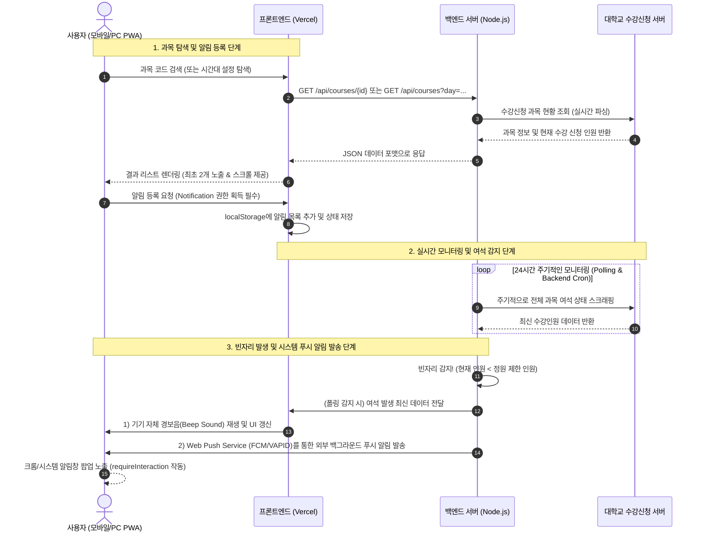

# 🌟 CourseAlert - 프로젝트 전반 통합 설명서

이 문서는 개발자, 운영자, 혹은 제3자가 **CourseAlert(성결대학교 수강신청 빈자리 알림 서비스)** 프로젝트를 처음 마주했을 때, 시스템의 전반적인 동작 구조와 기술 스택, 그리고 데이터 흐름을 한눈에 완벽히 이해할 수 있도록 작성된 종합 아키텍처 해설서입니다.

---

## 📌 1. 프로젝트 개요 (Overview)
* **서비스명**: CourseAlert
* **핵심 목표**: 성결대학교 수강신청 시 원하는 과목의 인원이 가득 찼을 때, 실시간으로 빈자리(여석)를 감지하여 유저에게 **소리(Beep)**와 **브라우저 시스템 푸시 알림(Web Push Notification)**으로 즉시 알려주어 신속한 수강신청을 돕는 PWA(Progressive Web App) 서비스입니다.
* **디자인 철학**: **Minimalist Obsidian Dark Theme**. 눈의 피로를 최소화하는 깊은 Charcoal 다크 계열 배경에 감각적인 피치 옐로우/골드 포인트를 더해 극도로 정갈하고 모던한 앱 감성을 제공합니다.

---

## 🛠️ 2. 사용된 기술 스택 (Tech Stack)

CourseAlert는 프론트엔드와 백엔드가 분리되어 밀접하게 협력하는 모던 웹 아키텍처로 설계되었습니다.

| 레이어 | 기술 스택 | 상세 역할 및 특징 |
| :--- | :--- | :--- |
| **프론트엔드 (Core)** | `React` (v18+), `TypeScript`, `Vite` | 컴포넌트 기반 UI 설계, 정적 타입 안전성 확보, 초고속 번들링 및 HMR 제공 |
| **상태 관리** | `React Hooks`, `useAlertStore` (Custom) | 로컬 스토리지(`localStorage`) 기반 자동 데이터 영속화 및 실시간 동기화 |
| **스타일링 (CSS)** | `Vanilla CSS` | 테일윈드 등의 라이브러리 없이 순수 CSS 변수(Variables)를 사용한 극한의 성능 및 다크/라이트 테마 큐레이션 |
| **모바일 앱화 (PWA)** | `Service Worker`, `Workbox`, `Web Manifest` | 오프라인 동작 지원, 홈 화면 추가(A2HS), 백그라운드 푸시 수신 서비스 워커(`push-sw.js`) |
| **백엔드 (API 서버)** | `Node.js`, `Express.js`, `TypeScript` | 수강신청 여석 파싱(Scraping/API Querying) 컨트롤러 및 실시간 웹 푸시 발송 서비스 |
| **데이터베이스 (DB)** | `localStorage` (브라우저 로컬 스토리지) 및 백엔드 인메모리(Memory) | 별도의 백엔드 데이터베이스 구축 없이 브라우저 저장소 및 서버의 초경량 인메모리 캐시만 사용하는 **Zero-DB 아키텍처**로, 서버 리소스를 극도로 아끼고 개인정보 노출 우려를 원천 차단함 |
| **프론트 배포** | `Vercel` | 깃허브 `main` 브랜치 푸시 시 자동 정적 최적화 및 글로벌 Edge CDN 배포 (CI/CD 자동화) |
| **백엔드 배포** | `Render` / `Vercel Serverless` / `PM2` | 크론탭(Crontab) 스케줄링을 통한 24시간 실시간 대학교 서버 모니터링 무중단 배포 |

---

## 🔄 3. 전체 데이터 및 요청 흐름 (Data & Request Flow)

CourseAlert 시스템의 상호작용 흐름은 아래와 같이 세 단계로 이루어집니다.



### 3-1. 각 흐름별 상세 설명

1. **과목 검색 및 필터링 흐름**
   * 사용자가 과목코드를 검색하거나 시간대 필터(예: 목요일 1-1교시)를 지정하여 검색하면, 프론트엔드는 백엔드 API에 데이터를 요청합니다.
   * **엄격 시간대 필터링(Strict Time Filtering)**: 시간대 검색 시 수업의 시작 교시와 종료 교시가 사용자가 설정한 영역 내에 완전히 속해 들어오는 과목만 선별하여 클라이언트에 출력합니다. (`from >= timeFrom && to <= timeTo`)

2. **알림 권한 동기화 및 등록**
   * 알림을 등록하기 전, 브라우저 시스템의 푸시 알림 권한(`Notification.permission === 'granted'`)을 반드시 검사합니다.
   * 권한이 허용된 경우에만 최종 등록이 이루어지며, 브라우저 스토리지(`localStorage`)에 저장되어 앱을 종료하거나 새로고침해도 끊김 없는 모니터링 리스트가 보존됩니다. (최대 5개 제한 적용)

3. **여석 폴링 & 백그라운드 푸시**
   * **앱 내부 실시간 동기화**: 사용자가 앱을 켜두고 있는 상태에서는 2초 간격으로 백엔드 API를 찔러 여석 현황을 실시간 갱신(Polling)합니다.
   * **앱 외부 알림 (Web Push)**: 사용자가 앱을 완전히 끄거나 휴대폰을 주머니에 넣어둔 상태에서도 알림을 받을 수 있도록, 백엔드에서 **VAPID 프로토콜**을 사용해 브라우저 푸시 채널로 페이로드를 쏘아 올립니다. PWA 서비스 워커([push-sw.js](file:///Users/cyuna/Desktop/CourseAlert_/CourseAlert%20%EB%B3%B5%EC%82%AC%EB%B3%B8/public/push-sw.js))가 이를 수신하여 화면에 알림을 팝업합니다.

---

## 🎨 4. UX/UI 디테일 최적화 요소

누구나 보고 감탄할 수 있는 디테일한 네이티브 모바일 앱 스타일의 경험을 위해 다음의 미세 조정 요소들이 프론트엔드 곳곳에 정초되어 있습니다.

* **5개 상한 제한 미끄럼틀 경고 (Slide-down Warning Toast)**
  * 과목을 5개 초과하여 등록하려 할 때, 브라우저 경고창 대신 최상단 헤더 바로 아래(76px)에서 부드럽게 미끄러져 내려오는 **크림슨 레드 글래스모픽 토스트**가 경고 아이콘과 함께 등장하여 시인성을 높이고 앱다운 고급스러움을 유지합니다.
* **오버스크롤 테마 컬러 완벽 동기화 (Overscroll Perfect Sync)**
  * iOS Safari나 Chrome 등에서 페이지를 잡아당길 때(Rubber-band effect) 발생하는 이질적인 배경 노출을 완전히 잡기 위해, `html` 및 `body` 요소 전체의 배경색을 다크 테마 색상으로 고정하고, `theme-color` 메타 태그를 `#141414`로 설정하여 시스템 배터리 영역까지 완벽하게 통일했습니다.
* **스마트 스크롤바 큐레이션 (Smart Scrollbar Curation)**
  * 전체적인 모바일 앱 무드를 위해 일반 화면 스크롤바는 완전히 제거(`display: none`)하되, 검색 결과 목록(`SearchResult`)의 경우 3개 이상의 데이터가 더 들어있음을 사용자가 알 수 있게 **5px 굵기의 미니멀한 상시 노출 커스텀 스크롤바**를 독립 삽입하여 편의성과 디자인을 모두 잡았습니다.
* **우측 정밀 대칭 레이아웃**
  * 검색 결과 목록에서 등록 여부를 한눈에 보게 만드는 배지를 텍스트 `[등록됨]` 대신 **골드 빛깔의 슬림 체크 SVG 마크**로 교체하고 신청 정원 현황(예: 39 / 40)의 바로 왼쪽에 0px 간격으로 초밀착시킴으로써 모바일 세로 뷰에서 극한의 좌우 밸런스를 달성했습니다.

---

## 🚀 5. 프로젝트를 시작하는 방법 (How to Run)

### 5-1. 환경 변수 설정
클라이언트 루트 폴더에 `.env` 파일을 생성하고 아래와 같이 백엔드 서버 주소를 지정합니다.
```env
VITE_API_URL=https://api.coursealert.com # 실제 백엔드 API 주소
```

### 5-2. 개발 서버 구동 및 로컬 빌드
```bash
# 의존성 패키지 설치
npm install

# 개발용 실시간 서버 구동 (기본 5173 포트)
npm run dev

# 프로덕션용 최적화 컴파일 및 PWA 빌드 테스트
npm run build
```
빌드가 정상적으로 완료되면 `dist/` 폴더 내에 서비스 워커와 캐시 파일들이 최종 생성되어 배포 준비가 완료됩니다.

---

## ⚠️ 6. 프로젝트의 현재 한계점 (Technical Limitations)

현재의 CourseAlert 아키텍처는 초경량성과 프라이버시 극대화에 맞추어져 있어, 대형 상용 서비스 관점에서는 다음과 같은 한계점을 갖습니다.

1. **클라이언트 로컬 저장소(`localStorage`) 의존성**
   * **한계**: 사용자의 모든 수강신청 모니터링 데이터가 개별 기기의 웹 브라우저 내부에만 존재합니다. 브라우저 캐시/쿠키를 지우거나, 기기를 바꾸거나(예: PC ➡️ 모바일), 사파리/크롬 브라우저 앱을 교차하여 사용할 시 알림 리스트가 동기화되지 않습니다.

2. **개별 폴링(Polling)으로 인한 대학 서버 부하 및 IP 차단 위험**
   * **한계**: 현재 클라이언트 앱은 켜져 있는 동안 2초마다 백엔드 서버를 찌르고, 백엔드는 대학교 수강신청 페이지를 실시간 스크래핑(파싱)합니다. 만약 수천 명의 동시 사용자가 각자 다른 과목을 등록해 앱을 켜두면, 백엔드가 대학 서버에 엄청난 양의 요청을 보내게 되어 대학 방화벽에 의해 백엔드 서버 IP가 **악성 트래픽(DDOS)으로 오인받아 즉시 차단(IP Ban)**될 수 있습니다.

3. **OS 및 브라우저 푸시 정책의 종속성**
   * **한계**: 백그라운드 푸시 기능은 각 모바일 OS(특히 iOS의 까다로운 PWA 알림 권한 정책) 및 브라우저 자체의 VAPID 푸시 구독 토큰 만료 주기에 영향을 받습니다. 또한 사용자가 직접 기기 OS 설정에서 "알림 스타일"을 변경하지 않으면 3초 만에 알림이 슬라이드 아웃되어 중요한 타이밍을 놓칠 위험이 존재합니다.

---

## 📈 7. 미래 확장성 로드맵 (Scalability & Future Extensions)

한계점을 극복하고, 서비스를 전국 단위 대학 혹은 수만 명 규모로 키우기 위한 기술적 확장 로드맵입니다.

1. **싱글 데몬 모니터링 및 중앙 브로드캐스팅 (Single-Daemon & Broadcast)**
   * **확장 방안**: 각 클라이언트가 독립적으로 백엔드를 호출하는 구조에서 탈피합니다. 백엔드에서 **단 하나의 백그라운드 크롤러 데몬(Daemon)**이 개설된 과목들의 여석 상태를 1회 긁어와 중앙 캐시(Redis 등)에 적재합니다.
   * 그 후, 동일한 과목의 알림을 등록한 수많은 유저들에게 **웹소켓(WebSocket) 또는 일괄 푸시(FCM Multi-cast)** 방식으로 단 한 번에 전송합니다. 이렇게 하면 유저 수가 1만 명으로 늘어나도 대학교 서버에 가해지는 스크래핑 부하는 항상 **1초에 단 1~2회 수준으로 완전 제어**됩니다.

2. **알림 전달 채널의 다각화**
   * **확장 방안**: 브라우저 시스템 알림의 한계를 넘어, 백엔드 API 서버에 외부 커뮤니케이션 모듈을 연동합니다.
   * 카카오톡 알림톡 API(Solapi 등), 이메일 서비스(SendGrid), SMS(Twilio), 혹은 디스코드/텔레그램 봇 API를 추가 연동하여 사용자가 앱을 켜지 않아도 가장 편한 채널로 빈자리 알림을 무조건 즉시 수신하도록 채널을 넓힐 수 있습니다.

3. **대학 범용 멀티-캠퍼스 PWA 템플릿화**
   * **확장 방안**: 성결대학교 시스템에 묶여 있는 수강신청 파싱 함수 및 과목 검색 규격을 플러그인(Plugin) 인터페이스 형태로 모듈화합니다.
   * 이를 통해 타 대학교(예: 서울대, 고려대 등)의 학사 포털 정보와 수강신청 파서 엔진 모듈만 교체해서 바로 꼽아 넣으면 일주일 만에 신규 대학용 수강신청 알림 앱을 빌드해낼 수 있는 **SaaS형 범용 대학 수강신청 PWA 프레임워크**로의 진화가 가능합니다.

---

## 🎯 8. 실제 서비스화 및 비즈니스 시나리오 (Service Scenarios)

CourseAlert를 교내 혹은 외부 벤처 서비스로 런칭할 때 실전에서 전개할 수 있는 3가지 정교한 배포 시나리오입니다.

### 시나리오 A. 교내 정보전산원 공식 연동 모델 (Official Partnership)
* **목표**: 학교 당국과 협력하여 공식적인 학사 지원 인프라로 인정받아 학내 서버 부하를 0%로 통제합니다.
* **시나리오**:
  1. 학교 정보전산원에 기획안을 제시하고, 스크래핑 방식 대신 **대학교 수강신청 학사 시스템의 여석 정보 Read-Only 데이터베이스 복제 서버(Replica) 혹은 공식 API** 사용 허가를 취득합니다.
  2. 학교 측으로부터 IP 화이트리스트(Whitelist) 혜택을 받고 학생처 공식 모바일 앱 내부에 웹뷰(WebView) 형태로 탑재하거나 공식 PWA로 선포됩니다.
  3. 교내 공식 PWA 앱이 됨으로써 전교생의 신뢰 속에 100% 바이럴 마케팅 효과를 쟁취하고, 서버 비용은 학교 측의 예산 지원을 받아 안정적으로 기동합니다.

### 시나리오 B. 프리미엄 부분 유료화 비즈니스 모델 (Freemium monetization)
* **목표**: 서비스 유지비를 넘어서는 비즈니스 가치를 창출하고, 고성능 알림 수요가 절실한 유저층을 대상으로 수익모델을 가동합니다.
* **시나리오**:
  1. **무료 등급 (Standard)**: 여석 모니터링 주기 30초, 푸시 알림 수신은 웹 브라우저 PWA 알림 채널로만 제공하며 최대 등록 한도를 3개로 제한합니다.
  2. **유료 등급 (Premium - 커피 한 잔 값 요금제)**: 모니터링 주기 **0.5초 극속 서치**, 빈자리 발견 시 **즉각적인 카카오톡 알림톡 및 전화(자동 ARS 보이스) 연동**, 과목 등록 한도 10개까지 확장 등의 기능을 수강신청 일주일 전 '시즌권 구독 요금제(예: 학기당 4,900원)'로 판매합니다.
  3. 졸업이 급박한 고학번 학생 및 꿀교양 과목 쟁탈을 원하는 수많은 재학생들의 고착 수요를 기반으로, 수강신청 기간마다 강력한 단기 폭발적 현금 흐름을 창출하는 명품 마이크로 SaaS 비즈니스로 전개합니다.

### 시나리오 C. FaaS 분산 아키텍처 및 IP 로테이션 망 구축 모델 (Anti-IP Block Deployment)
* **목표**: 학교 측의 비협조나 방화벽 차단을 무력화하고, 민간 영역에서 독자적으로 수만 명 규모의 트래픽을 완벽하게 수용합니다.
* **시나리오**:
  1. 수강신청 당일 동시 트래픽 폭발 시, 서버 단일 IP가 차단되는 것을 원천 차단하기 위해 **AWS Lambda / Vercel Serverless Functions**와 같은 서버리스 FaaS 구조를 전면 도입합니다.
  2. 수 천 개의 분산된 임시 컨테이너에서 각각 다른 IP 대역을 소유한 채 1초에 한 번씩 수강신청 서버의 가벼운 여석 데이터를 분할 요청합니다.
  3. 필요할 경우 상용 **IP 로테이션 프록시 API 서비스**를 연동하여, 학교 방화벽 시스템이 트래픽의 출처를 특정 지을 수 없도록 만들어 차단 위험을 0%에 수렴하게 관리하며 강인하고 질긴 무중단 실시간 모니터링 솔루션을 일반 재학생들에게 항시 유지해 줍니다.

